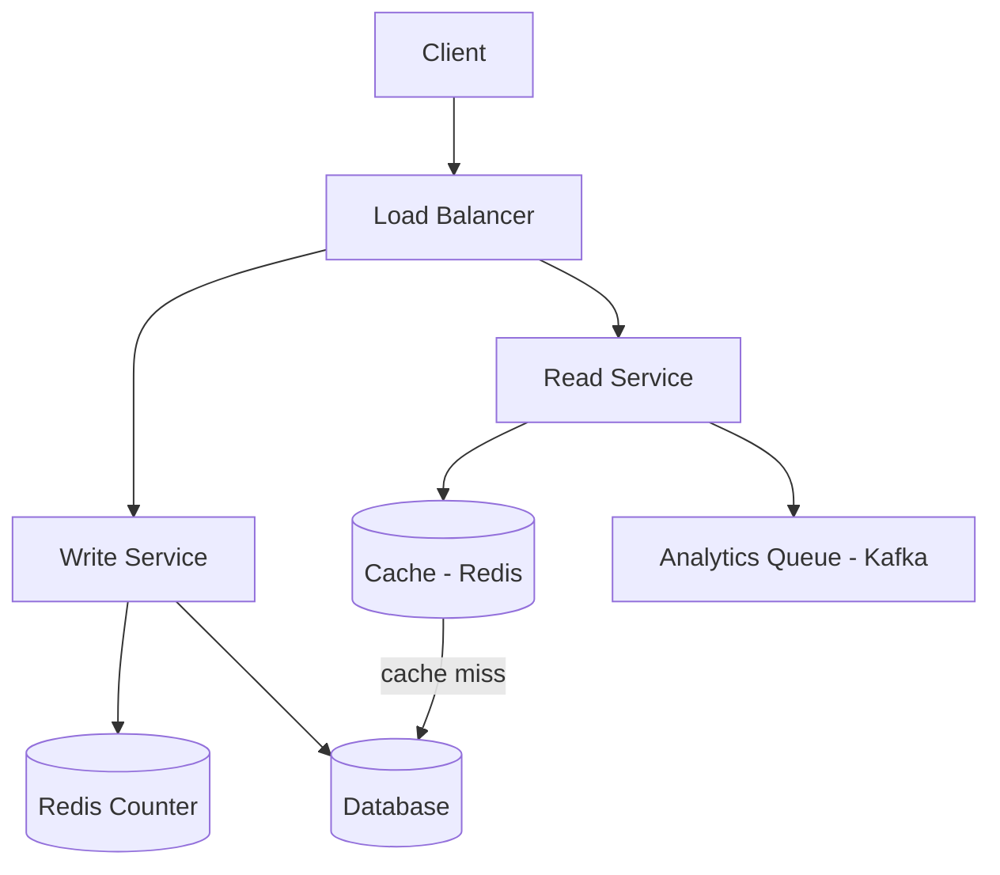
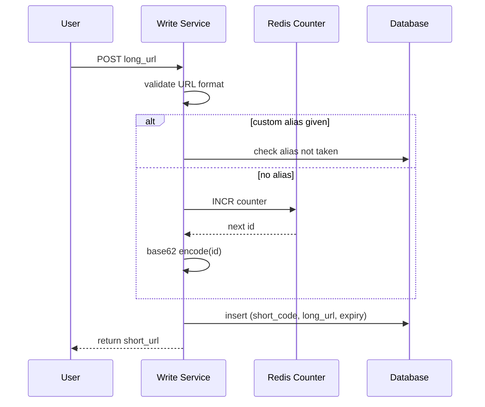
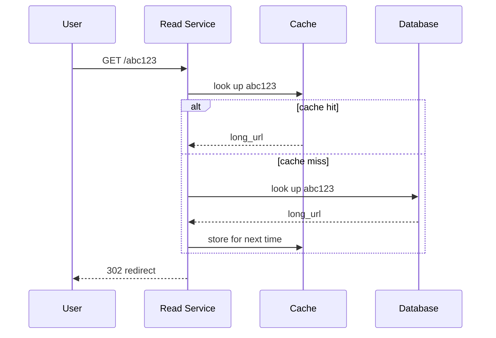

I've now read this question in about six different write-ups, watched two videos on it, and got asked a version of it in a real interview. So instead of letting all that sit scattered in random tabs, I'm putting it down here the way I'd actually explain it to a friend before their interview — no fluff, no "let's dive in," just the stuff that matters.
 
If you've never seen this question before: someone hands you a long, ugly URL and asks you to build the thing that turns it into `short.ly/aB3xQ9`, and when someone clicks that, sends them back to the original page. Sounds trivial. It is not trivial once you start asking "okay but what happens at a billion links a day."
 
Let's get into it.
 
## First, don't skip the questions
 
Every single write-up I read said the same thing, and I ignored it the first time I got this question and paid for it: ask before you design.
 
Here's roughly what I'd ask an interviewer:
 
- How many URLs are we shortening per day? (This changes literally everything downstream.)
- Can users pick their own short code, like a custom alias?
- Do links expire, or do they live forever?
- Do we need click analytics — how many times a link got clicked, from where?
- Is it fine if a redirect is occasionally a second or two stale, as long as the service itself never goes down?
You don't need all the answers to be exact numbers. You just need to show you're not going to design blind. In my failed attempt, I jumped straight to "we'll use a hash function" without even knowing the scale, and the interviewer politely asked me why. I didn't have a good answer.
 
## What we're actually building
 
Cutting through the noise, there are really just two things this system has to do:
 
1. Take a long URL, give back a short one.
2. Take a short URL, send the person to the original long one.
Everything else — custom aliases, expiry, analytics — is a nice-to-have on top. I'd say that out loud in an interview too: "these are the core two, everything else I'll treat as a bonus round."
 
And there's one non-obvious thing that shapes the entire rest of the design: **almost nobody creates short links, but everybody clicks them.** Reads absolutely dwarf writes here — think hundreds or even a thousand clicks for every one link created. Keep that ratio in your head, because it's the reason half the design decisions later on look the way they do.
 
## Quick math before drawing anything
 
I like doing this early because it stops you from over-engineering (or under-engineering) later.
 
Say we get 100 million new links a day:
 
```
writes per second  = 100,000,000 / 86,400        ≈ 1,160/sec
reads per second    = writes × 10 (read:write 10:1) ≈ 11,600/sec
```
 
If this thing runs for 10 years:
 
```
total links = 100M × 365 × 10 = 365 billion rows
storage     = 365B rows × ~100 bytes/row ≈ 36.5 TB
```
 
That's genuinely not a scary number for modern storage. A single SSD-backed database can hold tens of terabytes without blinking. So — and this surprised me the first time I actually did the math — **storage is not the hard part of this problem.** The hard part is answering 10,000+ reads a second at low latency, forever, without falling over. That reframing changed how I answered every follow-up question after that.
 
## How short should the code actually be?
 
We've got 62 characters to play with: `0-9`, `a-z`, `A-Z`. (We skip `+` and `/` from base64 because they mess with URLs — `/` looks like a path separator and `+` can turn into a space in a query string.)
 
| code length | max codes possible |
|---|---|
| 5 | 62⁵ ≈ 916 million |
| 6 | 62⁶ ≈ 56 billion |
| **7** | **62⁷ ≈ 3.5 trillion** |
| 8 | 62⁸ ≈ 218 trillion |
 
Seven characters gives you room for trillions of links, which comfortably covers our 365-billion estimate with a lot of headroom for growth. That's why basically every real implementation lands on 7.
 
## The API — nothing fancy
 
```
POST /api/v1/urls
{
  "long_url": "https://example.com/some/really/long/path",
  "custom_alias": "optional",
  "expiration_date": "optional"
}
→ { "short_url": "https://short.ly/aB3xQ9z" }
 
GET /{short_code}
→ 302 redirect to the long URL
   (410 if expired, 404 if it never existed)
```
 
## The shape of the system
 
Here's roughly how I'd draw this on a whiteboard:
 

 
Notice I split the write path and the read path into two separate services. This isn't just for show — because reads so heavily outnumber writes, you want to be able to throw more machines at redirects without touching the write side at all, and vice versa. It's a small detail but it's one that tends to separate a "fine" answer from a "good" answer in interviews.
 
### Creating a short link
 

 
### Clicking a short link
 

 
## How do you actually generate the short code?
 
This is the part every article spends the most time on, and honestly it's the part where you can sound smart or sound lost, depending on how well you know the trade-offs.
 
**Option 1 — Hash the long URL.** Run it through MD5 or SHA-256, base62-encode the result, chop off the first 7 characters. Problem: two different URLs can hash to the same first 7 characters. When that happens you either retry with a bit of salt tacked on, or check the database and try again. That database check on every single write is annoying at scale, so people usually put a Bloom filter in front of it to avoid hitting the database unless there's a real chance of a collision.
 
**Option 2 — Just use a counter.** Keep a number that goes up by one every time someone shortens a URL, and base62-encode that number. No collisions are even possible, because the number itself is guaranteed unique. This is the one I'd actually recommend leading with in an interview — it's simple and it works.
 
The catch is that if you've got multiple write servers, they all need to agree on "what's the next number." You can't have two servers both handing out `1042`. The fix people use is a single Redis instance doing atomic `INCR` — Redis is single-threaded internally, so two requests hitting `INCR` at the same time will never get the same value back. One gets 1042, the other gets 1043, guaranteed.
 
If you want to go further (and this is genuinely a good thing to bring up without being asked), have each write server grab a whole batch of IDs at once — say 1,000 — instead of calling Redis for every single URL. That cuts down the network chatter to Redis by a thousand times.
 
One thing people bring up as a downside of counters: they're predictable. If I know my link was `abc123`, I can probably guess `abc124` belongs to someone else and just... visit it. If that matters for your product, XOR the counter with a secret key before encoding it, so the sequence looks random from the outside even though internally it's still just counting up.
 
**Option 3 — Pre-generate a pile of keys in advance.** Some write-ups call this a Key Generation Service. Basically, a background job generates a huge batch of random unused 7-character codes ahead of time and stores them. When a request comes in, you just grab one that hasn't been used yet. It's a bit more infrastructure to run, but it means the actual write path never has to think about collisions at all — someone already solved that problem in advance.
 
I'd personally go with the counter approach when asked, mention the predictability issue on my own before they ask, and mention hashing as the alternative if they push back.
 
## Okay but let's actually write the algorithm, not just talk about it
 
Talking about "base62 encoding" in the abstract is easy. Actually writing it is where I've seen people freeze up on a whiteboard. So let me just put the real thing down.
 
### The counter + base62 approach, properly
 
```java
private static final String ALPHABET =
    "0123456789abcdefghijklmnopqrstuvwxyzABCDEFGHIJKLMNOPQRSTUVWXYZ";
 
public String encode(long counter) {
    StringBuilder sb = new StringBuilder();
    while (counter > 0) {
        sb.insert(0, ALPHABET.charAt((int) (counter % 62)));
        counter /= 62;
    }
    while (sb.length() < 7) {
        sb.insert(0, '0');   // pad so codes stay a fixed length
    }
    return sb.toString();
}
 
public long decode(String code) {
    long n = 0;
    for (char c : code.toCharArray()) {
        n = n * 62 + ALPHABET.indexOf(c);
    }
    return n;
}
```
 
That's genuinely the whole algorithm. `encode` keeps dividing by 62 and stacking up remainders (same thing I did by hand earlier in the base62-by-hand example), `decode` does the reverse — walk the string left to right, multiply what you have so far by 62, add the next digit's value. You don't need anything fancier than this. If someone asks you to trace through it with a small number on paper, that's exactly what they're checking for.
 
One small but real detail: start your counter at something like `100000000000` instead of `0` or `1`. If you start at 1, your first thousand or so short codes come out as single characters (`0`, `1`, `2`...`z`) which look broken/ugly and are trivially guessable. Starting from a big base number means every code comes out looking like a "proper" 7-character code from day one.
 
### The hash + collision approach, properly
 
```java
public String hashShorten(String longUrl) {
    MessageDigest md5 = MessageDigest.getInstance("MD5");
    byte[] digest = md5.digest(longUrl.getBytes());
    String hex = toHex(digest);              // 32 hex characters
    String base62 = base62Encode(hex);
 
    int start = 0;
    while (db.exists(base62.substring(start, start + 7))) {
        start++;                              // slide the window on collision
    }
    return base62.substring(start, start + 7);
}
```
 
The idea: MD5 gives you a long hash, you base62-encode it, and instead of always taking the first 7 characters, you slide a 7-character window across the hash until you find a chunk that isn't already taken in your database. It's a neat trick because you don't need a random salt loop — the hash itself has enough characters to try a few different windows before you give up and actually need a salt.
 
**But checking the database on every single write like this is slow at scale**, so this is exactly where a **Bloom filter** earns its keep. A Bloom filter is a small, memory-cheap structure that can tell you "this code is *definitely not* in the database" or "this code is *probably* in the database" — never wrong about the "definitely not" case, occasionally wrong about the "probably." So you check the Bloom filter first (fast, in-memory, no disk hit), and you only go bother the actual database when the Bloom filter says "might exist." Since most of the codes you generate won't collide with anything, this saves you the vast majority of database round-trips.
 
### The pre-generated keys (KGS) approach, properly
 
This one confused me the first time I read about it, so here's the mental model: instead of generating a code *at the moment* someone shortens a URL, you have a completely separate background service constantly generating random, unused 7-character codes ahead of time and stockpiling them.
 
It keeps two tables:
 
```
unused_keys table:  just a giant list of pre-generated, never-used codes
used_keys table:    codes that have already been handed out
```
 
When a write server needs a new code, it asks the Key Generation Service for one. The KGS grabs a code from `unused_keys`, immediately moves it into `used_keys` so nobody else can be handed the same one, and returns it. To make this even faster, the KGS keeps a chunk of unused keys sitting in memory and hands those out first, only touching the database when that in-memory chunk runs low.
 
Two things worth knowing about this approach if it comes up:
 
- **It's a single point of failure by itself**, ironically, since now your whole shortening flow depends on this one service being up. The fix is the same as anywhere else — run a standby replica that can take over.
- **If the KGS crashes while it's holding a batch of keys in memory that it already marked as "used" but hasn't actually handed to anyone yet, those keys are just wasted.** That's considered an acceptable loss given how many keys you have total — same logic as the Redis counter batching from earlier.
## Sharding the database when one instance genuinely isn't enough
 
I glossed over this earlier by saying "read replicas before sharding," which is true, but it's worth knowing what actual sharding looks like here in case someone pushes on it.
 
The simplest scheme: pick a range of counter values per database instance. Server 1 owns short codes from counter value `0` to `10 million`, server 2 owns `10 million` to `20 million`, and so on. When a write server needs a new code, it needs to know which range is currently "open" for writes — and that's a coordination problem in itself, since multiple write servers are running at once.
 
This is where something like **ZooKeeper** comes in, in the more detailed write-ups I read. ZooKeeper sits there as a coordination layer that tracks which counter range is currently assigned to which database instance, which instances are alive versus dead, and hands out a fresh range to a newly added server. Roughly:
 
1. A new database server boots up and asks ZooKeeper for an unused counter range.
2. ZooKeeper assigns it, say, `990,000,001` to `1,000,000,000`.
3. That server generates codes and inserts rows entirely within its own range — no coordination needed with anyone else once it has its range, no database lookup needed to check "does this already exist" because the range itself guarantees uniqueness.
4. Once that range is exhausted, the server is taken out of the "accept new writes" rotation (it can still serve reads) and a new server gets a fresh range from ZooKeeper.
5. If a server goes down mid-range, only that slice of data is affected — you'd fail over reads to a replica while you sort out the primary.
Redirecting a short code back to its long URL under this scheme is straightforward too: decode the short code back to its counter value, ask ZooKeeper (or a cached mapping of ranges, since this doesn't need to be looked up live every time) which server owns that range, and query that specific server directly.
 
I wouldn't lead with this in an interview — it's a "if we truly need multi-server writes at massive scale" answer — but knowing it exists and being able to sketch it if pushed is a good staff-level signal.
 
## Why redirects need to be fast, and how you make them fast
 
Say you've got a billion rows in your table. Without an index, looking up one short code means scanning through all of them — completely unworkable. So step one, boring as it sounds: make `short_code` your primary key. That alone gets you a proper index and O(log n) lookups instead of a full table scan.
 
But even a fast, indexed database lookup on disk takes real time compared to memory. Roughly:
 
- memory: ~100 nanoseconds
- SSD: ~0.1 milliseconds
- spinning disk: ~10 milliseconds
That's not a small gap — memory is something like a thousand times faster than SSD. So you put a cache (Redis or Memcached) in front of the database. Most requests hit hot, popular links anyway (the classic 80/20 split — 20% of your links get 80% of the clicks), so caching those hot ones gets you most of the benefit for a small amount of memory.
 
If you want to go one step further, you can push the redirect logic out to the edge — Cloudflare Workers, Lambda@Edge, that kind of thing — so a popular link resolves geographically close to the person clicking it and never even touches your main servers. That's a "nice to mention if there's time left" answer, not a "must have."
 
A couple of practical cache details that came up when I dug deeper into this:
 
- **Eviction policy**: LRU (least recently used) is the go-to. When the cache fills up, throw out whatever hasn't been touched in the longest time. A simple linked hash map gives you this behavior for free if you're implementing it yourself.
- **What if you're running more than one cache node?** On a cache miss, once you fetch the long URL from the database, don't just update the one node that missed — push that new entry out to your other cache replicas too, so the next person hitting a *different* node also gets a hit instead of another miss. If a replica already happens to have that entry, it just ignores the update.
- **Where do load balancers actually go?** Easy to think there's just one, but really there are three natural spots for one: between the client and your app servers, between your app servers and the database, and between your app servers and the cache layer. Starting with plain round robin at each of these is fine — it's simple, and if a server dies, the load balancer just quietly stops sending it traffic. You only need something fancier (checking actual server load before routing) once round robin starts sending traffic to servers that are already struggling.
## 301 or 302? This gets asked every single time.
 
I've seen this asked as a standalone follow-up in basically every account of this interview I've read, so memorize this table:
 
| | 301 (permanent) | 302 (temporary) |
|---|---|---|
| browser caches it? | yes | no |
| future clicks | go straight to the long URL, skip your server entirely | always come back to your server first |
| good for | reducing server load | tracking clicks, being able to change/expire the link later |
 
Real shorteners almost always use **302**, because if the browser starts caching the redirect and skipping your server, you lose the ability to track clicks or expire the link — and both of those matter more to a URL shortener's business than saving a bit of server load.
 
## The database
 
Keep it boring here. A simple table:
 
```sql
CREATE TABLE urls (
    short_code       VARCHAR(7) PRIMARY KEY,
    long_url         VARCHAR(2048) NOT NULL,
    user_id          VARCHAR(50),
    created_at       TIMESTAMP,
    expiration_date  TIMESTAMP NULL
);
```
 
I got asked "SQL or NoSQL" directly once, and my honest answer is: SQL, at least to start. Writes are so infrequent here — we calculated maybe a thousand a second at real scale, often much less — that a single well-indexed Postgres or MySQL instance handles this without breaking a sweat, and you get a free `UNIQUE` constraint on the short code for basically nothing. You'd only reach for something like DynamoDB or Cassandra if you were operating at a scale way beyond what most companies actually need, or needed active-active writes across multiple regions. Reaching for NoSQL by default here is one of those things that sounds impressive but usually isn't necessary.
 
## Scaling everything else
 
- The web/app layer is stateless, so scaling it is just "add more machines behind the load balancer." Nothing clever needed.
- Split read traffic and write traffic into separate services if you haven't already — they scale at completely different rates.
- Add read replicas to the database before you even think about sharding. Sharding is a last resort, not a first move.
- Rate-limit the write endpoint per IP or API key so nobody can spam-generate millions of links.
- If analytics matter, push click events onto a queue (Kafka works fine) and process them asynchronously. Do not make the redirect wait on writing an analytics event — that's the one path that has to stay fast no matter what.
- Run a small background job to clean up expired links eventually, and make sure your cache TTL is shorter than or equal to a link's expiry so a dead link doesn't keep serving from cache after it should be gone.
## Consistency vs. availability
 
If someone asks you the CAP theorem question here — and they might — the answer is availability wins. If a link I just created takes an extra second to show up on some replica, that's a minor annoyance. If the entire redirect service goes down because we were being overly strict about consistency, that's links breaking across Twitter, SMS, print ads, everywhere that link was ever shared. Being available matters a lot more than being perfectly consistent for this particular system.
 
## Questions people actually asked me (or that I found other people got asked)
 
**"What if two people shorten the exact same URL — same short code both times?"**
Not by default, no. Most shorteners deliberately give each request its own short code, even for a duplicate URL, because different people might want different expiry dates or want to track their own click stats separately. You could add deduplication by checking if the long URL already exists first, but it's usually not worth the extra write-path lookup.
 
**"Your Redis counter crashes right after handing a server a batch of IDs it hasn't used yet. What happens to those IDs?"**
They're just gone, and that's fine. We only need every code to be unique — we never promised the numbers would be perfectly sequential with no gaps. Wasting a few hundred IDs out of trillions available is not a real cost.
 
**"How do you stop someone from just guessing/scraping every short URL you've ever created?"**
Since the counter counts up predictably, XOR the number with a secret key (or run it through a simple reversible permutation) before you base62-encode it. Codes still stay unique, they just don't look sequential to anyone watching from outside.
 
**"Why not just use a UUID as the short code?"**
Because a UUID is 36 characters long, and the entire point of this service is to make URLs shorter. That would defeat the purpose.
 
**"Walk me through converting a number to base62 by hand."**
This one actually got asked as a live mini-exercise to me. Same idea as converting to any other base — divide by 62 repeatedly and read the remainders backwards:
 
```
11157 ÷ 62 = 179 remainder 59   → '9' is index 9... actually 59 maps to 'X'
179   ÷ 62 = 2   remainder 55   → 'T'
2     ÷ 62 = 0   remainder 2    → '2'
 
read remainders bottom to top: "2TX"
```
where 0–9 map to themselves, 10–35 map to `a`–`z`, and 36–61 map to `A`–`Z`. Worth practicing this on paper once before an interview so you're not fumbling with it live.
 
**"How would you add real-time analytics without slowing down the redirect?"**
Keep it completely off the critical path. Fire an event onto a queue the moment a redirect happens and return the response to the user immediately — don't wait around for the analytics write to finish. Process and aggregate those events separately, on a delay if needed.
 
## If I had 60 seconds to summarize this out loud
 
"This is a read-heavy system, so I'd design around that from the start — separate, independently-scaled services for reading and writing, a Redis-backed counter with base62 encoding for generating codes, a cache sitting in front of an indexed database for fast redirects, 302s so we keep the ability to track and expire links, and an async pipeline for analytics so it never touches the redirect's latency. Storage really isn't the challenge here — a few terabytes is nothing for modern hardware. The actual challenge is serving a huge, constant stream of reads fast, and that's what caching and read-scaling solve."
 
---
 
