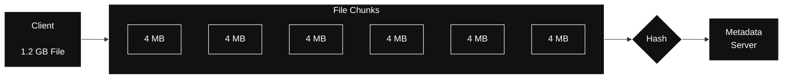
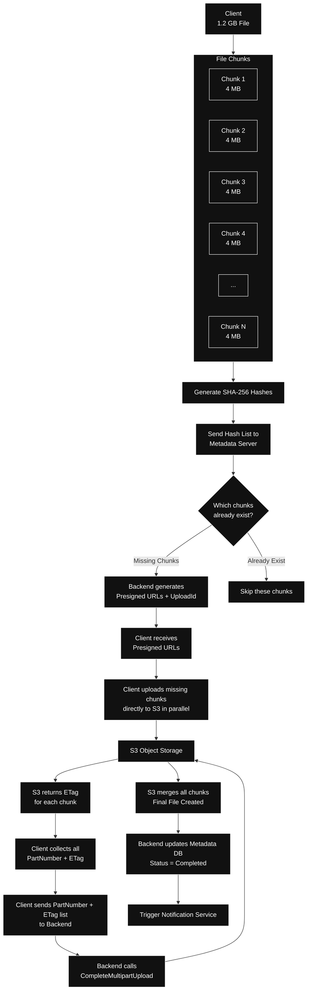

I found lots of tutorials on YouTube, Medium. I read all of them. Just like I do for other systems when I’m really curious. But I found they touch only the basic part. They don’t go into depth.

So here I’m putting the things that I have read, understood from those blogs, videos.

I will cover only Upload file part. 

So what do you think what happens when you upload the file?

Think aloud….

Let me tell you what I thought, ok?
I thought when we upload the file ..

The flow was like this

`Client uploading 1 GB file -> Backend Server -> Blob storage`

Pretty basic flow, right? Everyone will think like this only if they are aware about frontend backend architecture. But internally there is something more.

If we do like this, I mean uploading the whole file in one single API, then this is really a bad design.

Because what if there is a network issue? You have to upload the file again.
What if you changed only one line of the file, you have to upload again.

Right?

So what is the solution?

Solution is ***Chunking***

And why do we chunking?. Because of some really great pros like

**Resumable uploads**, we can upload multiple chunks **parallelly** which will make the upload really faster compared to monolith upload. **Delta sync** is another one which will upload only the changed parts.

One more advantage is **deduplication** of same chunk data.

For example suppose after hashing of chunk 1 & chunk 5 coming same hash value, then we can avoid uploading same chunk data again to save the resource.

I will talk about hashing in few moments.

Also caching of chunk is manageable rather than caching the entire big 1 GB file.

I found the real numbers of chunk size for Dropbox is 4 MB, while Google Drive have ( 2 to 16 MB) chunk size.

Till here you understood why we need chunking. Im actually trying to make you understand first about the concepts before directly jumping on High level design of Dropbox ok?

Good.

Now listen this “Fixed size chunking” which is 4 MB block is also not good in some scenarios ok?

Because this comes with “Boundary Shift Problem” which means insert one byte and all subsequent chunks change.

For example:

Suppose your file chunked is of 4 MB size like this

`AAAA BBBB CCCC DDDD`

Now in between we added 1 byte ‘X’

And then it becomes like this

`AAAA XBBB BCCC CDDD D`

Which caused whole chunks to be changed. That’s why fixed chunking is good for starting and its simple also. But in real world this is not perfect because even for 1 change we have to reupload again multiple times.

And to solve this problem we do “Content Based Chunking” CDC like **Rabin fingerprinting.**

CDC does not cut at fixed positions. Basically this looks at the content it self and decides where to cut.

Original file

`[AAAA][BBBB][CCCC][DDDD][EEEE]`

After inserting 1 byte, only the first chunk got changed

`[XAAA][BBBB][CCCC][DDDD][EEEE]`

I will talk about Robin fingerprinting in new blog, to save your time here.

Ok coming back to Hashing, that we did after breaking the file into chunks

For example

1.2 GB file -> 300 Chunks (4MB) -> then doing SHA-256 of each chunk

We are doing chunk because we need integrity check later, also to avoid deduplication of same chunk upload. We are using Secure hash algorithm with 256 bit output. Give same input to this algorithm you will going to get same output.

Ok we talked alot about chunking.

Now if we have to upload the file, the very good approach i learned after burning mid night oil from blog is directly upload the file to S3, without touching the backend server.

What i mean without touching the backend server is, don’t upload the file to backend server first and then to S3.

It will unnecessary consume lots of resource, actually here you are uploading twice indirectly. That’s why i’m saying client should directly upload the file to S3. But how?

Lets learn about this now.

So when you are uploading the 1.2 GB file by selecting the file from your local device.

So backend first creates a multipart upload on S3 and gets the UploadId. Then it generates presigned URLs for every chunk using that UploadId. Client takes those URLs and directly uploads the raw chunk data to S3. At the same time backend marks the file state as “Uploading” in the metadata database.

After client finishes uploading all the chunks, it sends the list of PartNumber + ETag back to the backend. Backend then calls CompleteMultipartUpload on S3. Only after this call S3 merges all the chunks in order using the UploadId and ETags.

S3 doesn’t automatically notify the backend when parts are uploaded. The CompleteMultipartUpload step is compulsory. Once that succeeds, S3 can fire an event (if configured) and backend updates the state to completed.

UploadId stays the same for the entire file, while every chunk gets its own ETag. Both are needed for the final merge.

If chunk 5 fails, S3 only throws error for that part. Client just retries chunk 5 again. No need to upload the whole file, so resuming after network failure becomes easy.

**Final diagram (Upload)**

This is all for now, I hope you enjoyed this blog. I will cover the next part soon, which is downloading the file and syncing of file too.\
Thanks
